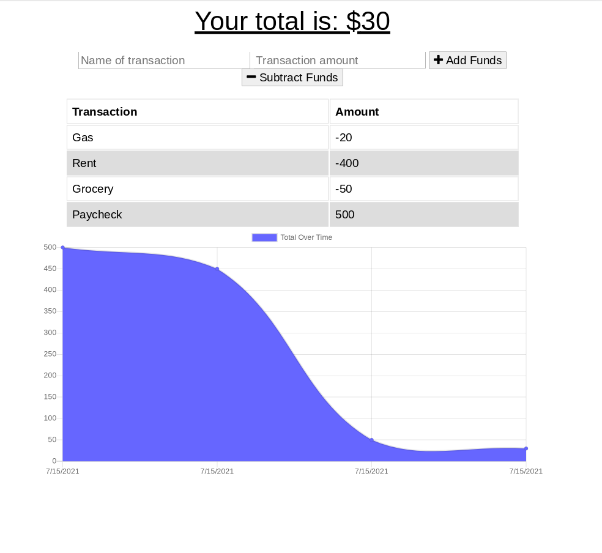

# Budget Tracker

## Description
An application that allows users to track their budget by adding expenses and deposits with or without an internet connection

## Made With
* HTML
* CSS
* JavaScript
* Node.js
* IndexedDB

## Packages
* Mongoose
* Compression
* Express.js
* Morgan

## Application
[Budget Tracker Application](https://budget-tracker03.herokuapp.com/)

## Usage
Enter an amount and indicate if it's being deposited or expensed to track the budget. If there is low or no internet connection, the input will be saved on the tracker and be updated when connectivity resumes.

## Screenshot

## Credit
Angela Man